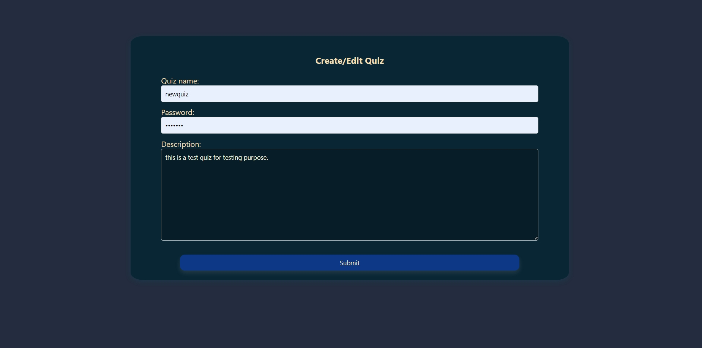
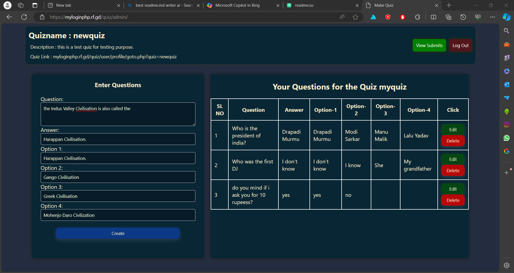
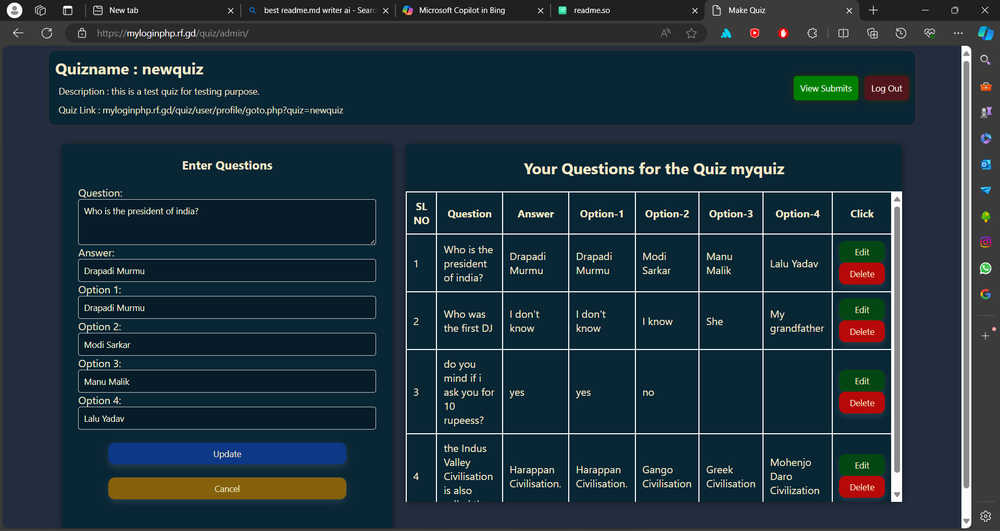
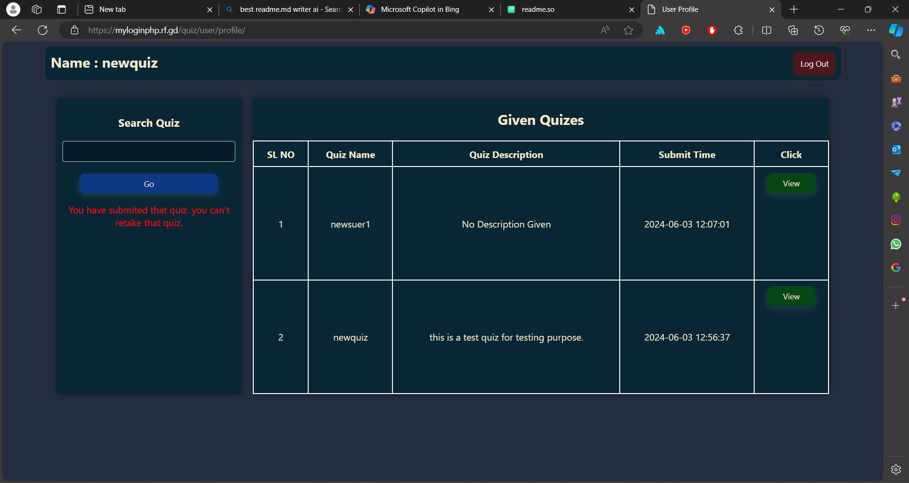
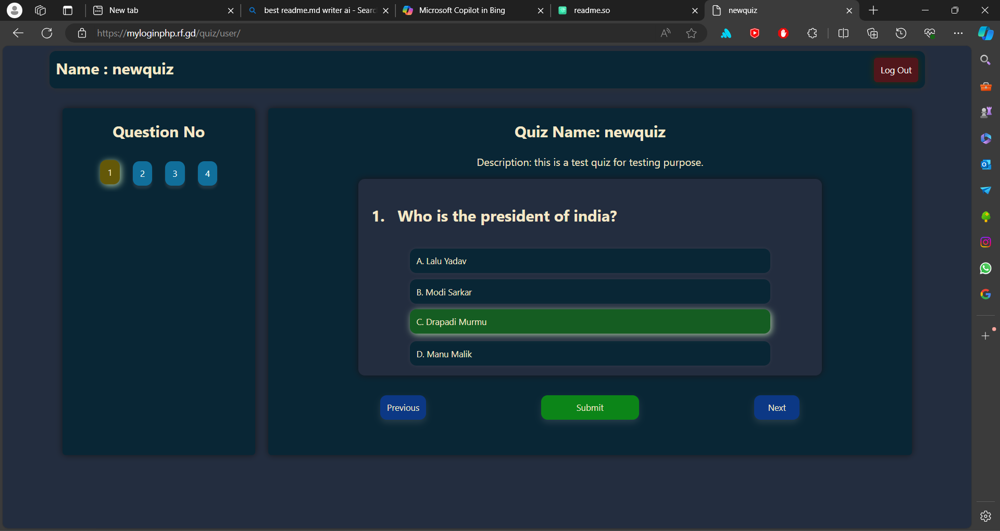
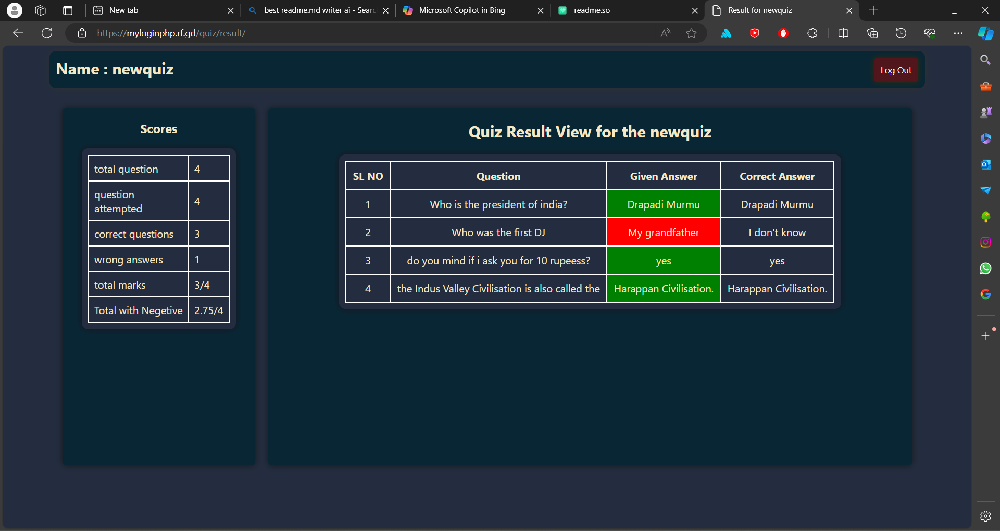

# Quiz

This is a PHP-based quiz website that allows users to test their knowledge by answering quiz questions. The project uses HTML, CSS, JavaScript, PHP, and MySQL.

## Demo

View/Use the project/site hosted on [Quiz-App](http://myloginphp.rf.gd/quiz)\
don't use any such informations that can expose your privecy.

## Project Structure

The project directory contains the following files:
- **[admin/](https://github.com/h4jack/quiz/blob/main/admin)**
    - `index.php`: Main admin page.
    - **[login/](https://github.com/h4jack/quiz/blob/main/admin/login)**
        - `index.php`: Admin login page.
    - **[submits/](https://github.com/h4jack/quiz/blob/main/admin/submits)**
        - `index.php`: Submission handling page.

- **[css/](https://github.com/h4jack/quiz/blob/main/css)**
    - `admin.css`: Styles for the admin interface.
    - `body.css`: General styles for the website body.
    - `button.css`: Styles for buttons.
    - `input.css`: Styles for input fields.
    - `login.css`: Styles for login-related elements.
    - `main.css`: Main stylesheet.
    - `nav.css`: Styles for navigation elements.

- **[db/](https://github.com/h4jack/quiz/blob/main/db)**
    - `dbconn.php`: Database connection configuration.

- **[div/](https://github.com/h4jack/quiz/blob/main/div)**
    - `nav.php`: Navigation component.

- **[method/](https://github.com/h4jack/quiz/blob/main/method)**
    - `string.php`: PHP methods related to string manipulation.

- **[result/](https://github.com/h4jack/quiz/blob/main/result)**
    - `index.php`: Page displaying quiz results.

- **[submit/](https://github.com/h4jack/quiz/blob/main/submit)**
    - `index.php`: Submission handling page.

- **[user/](https://github.com/h4jack/quiz/blob/main/user)**
    - **[getquiz/](https://github.com/h4jack/quiz/blob/main/user/getquiz)**
        - `index.php`: User page for accessing quizzes.
    - **[login/](https://github.com/h4jack/quiz/blob/main/user/login)**
        - `index.php`: User login page.
    - **[profile/](https://github.com/h4jack/quiz/blob/main/user/profile)**
        - `goto.php`: Profile navigation logic.
        - `index.php`: User profile page.

- `index.php`: Main entry point for the quiz app.
## Installation
To run and test this on local machine, follow these steps:

#### install xampp on your local machine.
if you know how to run php web app skip this steps,\
refer to this site for setup your own xampp server:
[wikihow](https://www.wikihow.com/Set-up-a-Personal-Web-Server-with-XAMPP)

- Start the Apache Server.
- Start the Mysql Server.

#### clone the repo to your htdocs of xampp
```cmd
git clone https://github.com/h4jack/quiz.git C:\{path_to_xampp}\xampp\htdocs\quiz
```
#### now open the link on your browser.
[http://localhost/quiz/](http://localhost/quiz/)
## Usage

To use the quiz app follow this below example, or try using it on the hosted server.

### Admin
- login as the quiz name:

- create quiz:

- edit/update/delete the quiz

### User
- login same as you logged in on admin/quiz side.
- enter the quiz name and go to give the quiz.

- give quiz answer/ and submit when you think it is completed.

- see the result by clicking on the view button.


## Expression Calculator Features

the quiz app provides the following features:
- quiz creation
- quiz taking.
- view result.
- and all the user/admin level features.
## Tech Stack

**Client:** HTML, CSS, JS

**Server:** PHP, MariaDB MySQL(SQL).


## Authors

- [@h4jack](https://www.github.com/h4jack)

## Contribute

This project open source you can contribute to this just clone and improve this project.

## License

This project is licensed under the [GPL-3.0 license](https://github.com/h4jack/quiz/blob/main/LICENSE/)


## Feedback

If you have any feedback or suggestions, please feel free to [create an issue](https://github.com/h4jack/quiz/issues) or [contact us](https://github.com/h4jack).
